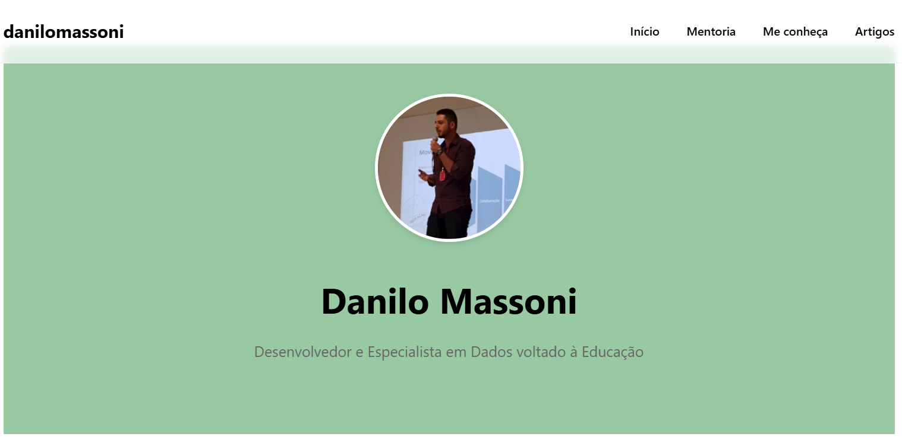

 Danilo Massoni - Site Pessoal

Site pessoal e profissional focado em compartilhar conhecimento sobre tecnologia, dados e educação.

 🚀 Sobre o Projeto

Este site foi desenvolvido para ser um hub central de conteúdo e serviços, oferecendo:

- Mentorias personalizadas em tecnologia
- Artigos técnicos e tutoriais
- Portfólio de projetos
- Informações sobre minha trajetória profissional

 🛠️ Tecnologias Utilizadas

- HTML5
- CSS3
- JavaScript Vanilla
- Design Responsivo

 📋 Estrutura do Projeto 

 🌟 Funcionalidades

- **Mentoria Personalizada**: Diferentes pacotes de mentoria adaptados às necessidades do cliente
- **Blog**: Artigos técnicos sobre programação, dados e educação
- **Responsividade**: Interface adaptável para diferentes dispositivos
- **Carrossel de Depoimentos**: Feedback de alunos e mentorados
- **Seção de Impacto**: Números e resultados alcançados

 📱 Responsividade

O site é totalmente responsivo, adaptando-se a diferentes tamanhos de tela:
- Desktop (1024px+)
- Tablet (768px - 1023px)
- Mobile (até 767px)

 🔗 Links Importantes

- [Site ao vivo](https://danilomassoni.github.io/portfolio)
- [LinkedIn](https://www.linkedin.com/in/danilo-massoni)
- [GitHub](https://github.com/danilomassoni)
- [Medium](https://medium.com/@danilomassoni)

 📫 Contato

Para mentorias ou parcerias, entre em contato através do [LinkedIn](https://www.linkedin.com/in/danilo-massoni) ou WhatsApp.

 📄 Licença

Este projeto está sob a licença MIT - veja o arquivo [LICENSE.md](LICENSE.md) para detalhes.

---
Desenvolvido por Danilo Massoni 